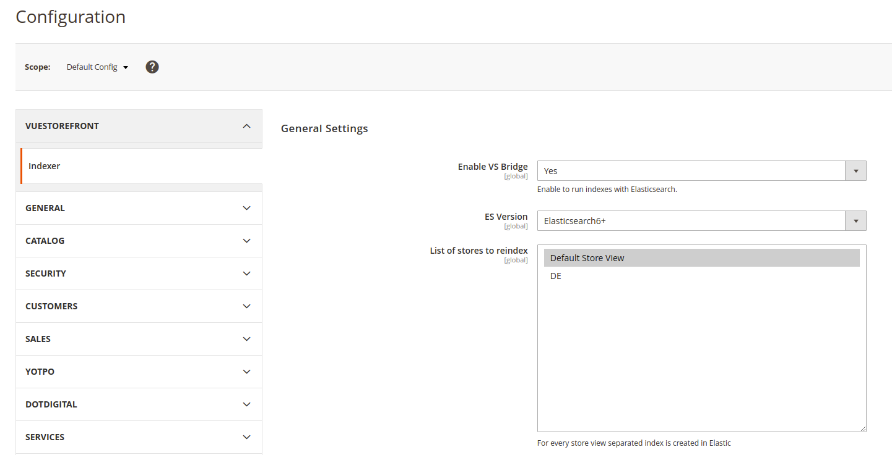
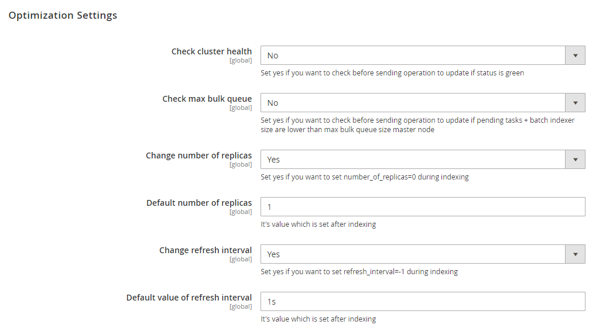
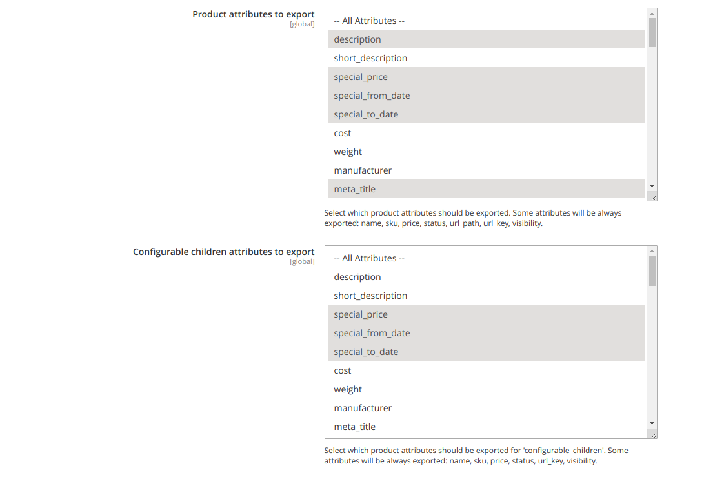
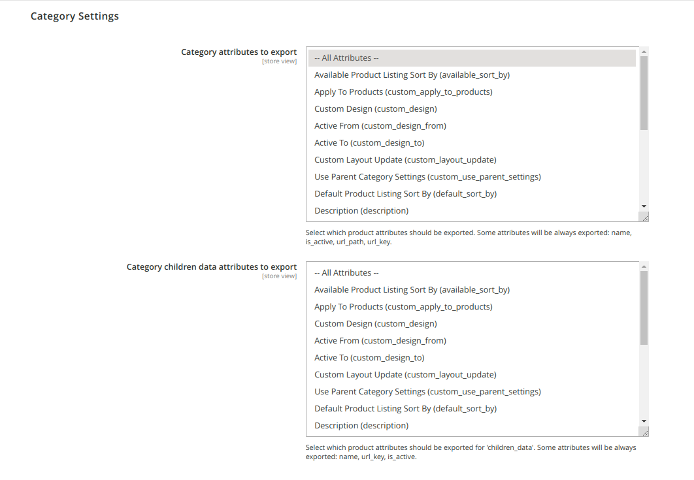

### Magento Configuration
Go to the new ‘Indexer’ section (Stores → Configuration → Vuestorefront → Indexer), available now in the in the Magento Panel, and configure it in the listed areas:
1. ####General settings 

   **Enable VS Bridge** → Enable to export data to elasticsearch. By default indexing is disable.

    **Elasticsearch version**
    
    Select ES version depends on which ES you are using/is used by magento.
    If you are using ES 5.x.x, choose Elasticsearch5, if you are using version 6.x.x or 7.x.x choose Elasticsearch6+.
    By default Elasticsearch5 option is selected.
    
    **List of stores to reindex** → Select stores for which data must be exported to ElasticSearch. By default store with ID 1 is selected. For each store view, a new, separate ElasticSearch index is created.

    

1. ####Elasticsearch Client

   Configure connection with ElasticSearch. Provide a host, port, and set up login and password (optionally).

   

1. ####Indicies settings
 
   **Batch Indexing Size** → select size of packages by which you intend to send data to ElasticSrearch. Depending on the project you might need to adjust package size to the number of products, attributes, configurable products variation, etc). By default Batch, Indexing Size is set up for 1000.
   Indicies settings
    
   **Index Alias Prefix** → define prefixes for ElasticSearch indexes. The panel allows adding prefix only to the catalog name e.g.: "vue_storefront_catalog". For each store (store view) index name is generated on the base of defined prefix and either ID or Store Code. Aliases cannot be created. 
   Example: When we define following indexes: "vue_storefront_catalog_1", "vue_storefront_catalog_2", "vue_storefront_catalog_3".
   
   Note: change to "vue_storefront_catalog" to make it compatible with [mage2vuestorefront](https://github.com/DivanteLtd/mage2vuestorefront/) import.
   
   **Important**: It is crucial to update this configuration in the VSF and VSF-API (one change at the beginning of the whole configuration process).

   **Index Identifier** → defines the unique store identifier to append to the ElasticSearch indexes. The default value is ID which will append the Store ID to the index name e.g.: "vue_storefront_catalog_1". You can choose to change this to Store Code which will add the Store Code to the index name e.g.: "vue_storefront_catalog_storecode".
   
   **Add Index Identifier to Default Store View** → defines if we should add Index Identifier to Magento Default Store View. Select "No" - to make it compatible with [mage2vuestorefront](https://github.com/DivanteLtd/mage2vuestorefront/) import. 
      
   ####Example with Store ID
  
   "vue_storefront_magento_1" - index for store view with id 1
   
   VSF config (base on default index prefix name: vue_storefront_magento)
    ```json
    "elasticsearch": {
      "httpAuth": "",
      "host": "localhost:8080/api/catalog",
      "index": "vue_storefront_magento_1"
    }
    ```
   
    VSF-API config
    ```json
      "elasticsearch": {
        "host": "localhost",
        "port": 9200,
        "user": "elastic",
        "password": "changeme",
        "indices": [
          "vue_storefront_magento_1"
        ],
    ```
   
   ####Example with Store Code
   
   "vue_storefront_magento_en_us" - index for store view with code "en_us"
   
   VSF config (base on default index prefix name: vue_storefront_magento)
    ```json
    "elasticsearch": {
      "httpAuth": "",
      "host": "localhost:8080/api/catalog",
      "index": "vue_storefront_magento_en_us"
    }
    ```
   
    VSF-API config
    ```json
      "elasticsearch": {
        "host": "localhost",
        "port": 9200,
        "user": "elastic",
        "password": "changeme",
        "indices": [
          "vue_storefront_magento_en_us"
        ],
    ```
   
   
   
1. ####Redis Cache Settings

    **Clear cache** → Yes/No (by default this option is disabled)
    
    **VSF base Url** → URL for VSF
 
    **Invalidate Secret cache key** → provide the same value as in the VSF configuration
 
    **Connection timeout** → by default set up for 10 seconds
    
     

1. ####Optimization Settings

    **Check cluster health** → by default this option is disabled. Used to check cluster health before indexing.
    
    **Check max bulk queue** → by default this option is disabled. Used to check if pending tasks + batch indexer size (VueStorefrontIndexer indices setting) are lower than max bulk queue size master node.
    
    **Change number of replicas** → by default this option is disabled. Used to set number_of_replicas=0 during indexing.
    
    **Default number of replicas** → number of replicas which is set after indexing.
    
    **Change refresh interval** → by default this option is disabled. Used to set refresh_interval=-1 during indexing.
    
    **Default value of refresh interval** → value of refresh interval which is set after indexing.
    
    

1. ####Catalog Settings
    
    **Use Catalog Url Keys** → by default this option is disabled. Use Magento Url Key attribute for url_key and slug field (for products and categories). Url Keys have to be unique
    
    **Use Magento Url Key and ID to generate slug for VSF** -> by default slug (and url_key) field is generated base on product/category NAME and ID
    
    **Sync Tier Prices** → by default this option is disabled. Used to sync products tier prices. 
    
    **Types of products to index** → by default all product will be exported to ElasticSearch. This option allows for selecting certain product types that should be exported.
    
    **Add swatches to `product.configurable_options`** → by default No. Use to export information about swatches directly for a product type. 	 
    
    **Apply catalog price rules in `final_price`**  → by default No. Set option to Yes if you use Catalog Price Rules and have Magento version 2.2.4 (or any previous version).
    
    
    
    **Product attributes to export***  → choose product attributes for export.
    By default only part of attributes will be exported, like: description, image, small_image, thumbnail, 
    media_gallery, media_title, meta_description, special_price, special_from_date, special_to_date, tax_class_id.
    
    **Configurable children attributes to export***  → choose product attributes for export.
    For configurable_children attributes used to create configurable products are also always exported 
    plus attributes set in configuration (by default: image, small_image, thumbnail, media_gallery, special_price, special_from_date, special_to_date)
    
    

 * Some attributes are always exported: price, sku, name, visibility, status, url_path, url_key
 
 1. #### Category Settings
    **Category attributes to export**  → choose category attributes for export. By Default all attributes are exported.
    
    **Category children data attributes to export**  → choose attributes for export for sub categories. Some attributes will be always exported: name, url_key, is_active, url_path. 

    

After updating the configuration, you can run the indexation.
It is also worth query ElasticSearch using CURL, to be sure that the communication works.
